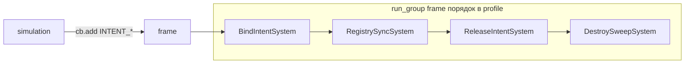

# Intent pipeline + Resource-реестры (PGDECS 2.0)

Ядро PGDECS: **SoA + query + systems + command buffer + profile**.  
Связь с Node, RID, variable-length data и пулами — **в игровом коде** через:

1. **Resource-реестры** (side-table вне ECS)
2. **Intent-теги** (marker components)
3. **Упорядоченные системы** в `run_group`

См. также: [OBJECT_COMPONENTS.md](OBJECT_COMPONENTS.md), [examples/](examples/).

---

## Философия v2

- Ядро **не владеет** внешними ресурсами и **не вызывает** `release` при `destroy_entity`.
- В SoA — только примитивы: slot (`Int32`), RID (`Int64` через `get_id()`), позиции, флаги.
- Реестры — `Resource` в игре, передаются в системы через `@export` в [`ECSSystemStrategy`](config/ecs_system_strategy.gd).
- **Bridge-слой удалён в 2.0** — один `BRIDGE_HANDLE` на entity не покрывал визуал + звук + nav; intent + несколько slot-компонентов гибче.

---

## Resource-реестры

Контейнер зависимостей (пример [`example_ecs_dependencies.gd`](examples/dependencies/example_ecs_dependencies.gd)):

```gdscript
class_name GameEcsDependencies extends Resource

@export var node_registry: ECSNodeRegistry
@export var nav_path_registry: NavPathRegistry  # игра
```

Strategy инжектит зависимости в систему:

```gdscript
@export var dependencies: ExampleEcsDependencies

func create_system(ecs: ECSManager, _world: ECSWorld = null) -> ECSSystemBase:
    return ExampleBindIntentSystem.new(ecs, dependencies)
```

Базовый реестр: [`ecs_node_registry.gd`](examples/registries/ecs_node_registry.gd) (`ECSNodeRegistry` extends `Resource`).

---

## Intent-теги (соглашение)

| Tag | Смысл |
|-----|--------|
| `INTENT_BIND_*` | Запрос привязать внешний ресурс (визуал, nav path, audio) |
| `INTENT_RELEASE` | Освободить все slot'ы entity перед destroy |
| `INTENT_DESTROY` | Финальная метка: entity можно удалить из ECS |

Intent — **tags** (`register_tag`), без SoA-значения. Константы: [`example_intent_ids.gd`](examples/schema/example_intent_ids.gd).

Данные после bind остаются в **slot-компонентах** (`NODE_SLOT`, `PATH_SLOT`, …) — `TYPE_PACKED_INT32_ARRAY`, `-1` = нет.

---

## Системы и порядок кадра



| Система | Query | Действие |
|---------|-------|----------|
| **BindIntentSystem** | `INTENT_BIND_*` | `registry.acquire()` → `*_SLOT` → `remove_component(INTENT)` |
| **RegistrySyncSystem** | slot + simulation data | SoA → registry (Node/RID/server) |
| **ReleaseIntentSystem** | `INTENT_RELEASE` | `registry.release(slot)` → slot = -1 → снять intent |
| **DestroySweepSystem** | `INTENT_DESTROY` | `destroy_entity` (после release) |

Порядок: **порядок `system_strategies` в profile** (все в `run_group = frame`). Пример: [`example_intent_world_profile.gd`](examples/intent/example_intent_world_profile.gd).

### Simulation → intent

```gdscript
# В combat / gameplay system (command buffer):
cb.add_component(entity_id, ExampleIntentIds.INTENT_DESTROY)
# или сначала release:
cb.add_component(entity_id, ExampleIntentIds.INTENT_RELEASE)
```

### Mass destroy

Один проход в Release + Sweep или объединённая система:

```gdscript
for entity_id in query.get_entity_ids():
    release_slots(entity_id)
    cb.destroy_entity(entity_id)
```

---

## Полный lifecycle (spawn → bind → sync → death)

1. **Spawn:** `create_entity` + `POSITION` + опционально `cb.add_component(e, INTENT_BIND_NODE)`.
2. **Bind (frame):** slot в SoA, intent снят.
3. **Sync (frame):** читает `POSITION` + `NODE_SLOT` → пишет в Node/RID.
4. **Death (simulation):** `INTENT_RELEASE` или сразу `INTENT_RELEASE` + `INTENT_DESTROY`.
5. **Release (frame):** очистка registry.
6. **Sweep (frame):** `destroy_entity`.

При `reset_world()` — вызовите `registry.clear()` в игровом коде (ядро реестры не знает).

---

## RID и variable arrays

- **RID** — `Int64` компонент + `rid_from_int64()` на границе Server API.
- **Переменный путь (nav)** — `PATH_SLOT` + `NavPathRegistry` Resource, не массив в SoA.
- Подробнее: [OBJECT_COMPONENTS.md](OBJECT_COMPONENTS.md).

---

## Миграция с bridge (1.x)

| 1.x bridge | 2.0 intent |
|------------|------------|
| `BRIDGE_TYPE` + `BRIDGE_HANDLE` | Отдельные `*_SLOT` на домен (visual, audio, nav) |
| `TAG_BRIDGE_PENDING_ACQUIRE` | `INTENT_BIND_*` |
| `TAG_BRIDGE_PENDING_RELEASE` | `INTENT_RELEASE` |
| `ECSBridgeOrchestratorSystem` | `ExampleBindIntentSystem` + `ExampleReleaseIntentSystem` |
| `ECSBridgeSyncSystem` | `ExampleRegistrySyncSystem` (игра) |
| `bridge_registry_strategy` | `@export dependencies: GameEcsDependencies` в strategies |

---

## Observers (вне scope ядра)

Batch structural events (`on_entities_destroyed`) — возможное расширение. Сейчас достаточно **intent + query**; см. обсуждение в ADR в [DESIGN.md](DESIGN.md).

Stub-примеры: [`examples/intent/`](examples/intent/).
