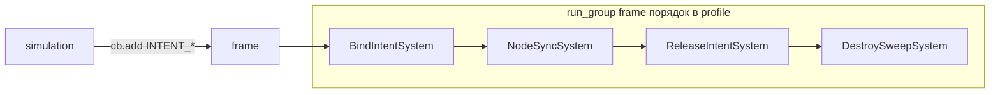

# Intent pipeline + reference-компоненты (PGDECS 2.0)

Ядро PGDECS: **SoA + query + systems + command buffer + profile**.
Связь с Node, RID, variable-length data и пулами — **в игровом коде** через:

1. **Reference-компоненты** (`NODE2D`, `NODE`, `RESOURCE`, `REFCOUNTED`) — ссылка хранится в SoA
2. **Resource-сервисы** (пул нод, navmesh, audio bus, сетевой маппинг) — `@export` в [`ECSSystemStrategy`](config/ecs_system_strategy.gd)
3. **Intent-теги** (marker components)
4. **Упорядоченные системы** в `run_group`

См. также: [OBJECT_COMPONENTS.md](OBJECT_COMPONENTS.md), [examples/](examples/).

---

## Философия v2

- Ядро **не владеет** внешними ресурсами и **не вызывает** `release` при `destroy_entity`.
- Ссылка на объект живёт в **reference-компоненте** (`NODE2D`/`NODE`/`RESOURCE`/`REFCOUNTED`); int-slot в side-table не нужен.
- **Сервисы** (пулы, фабрики, navmesh) — `Resource` в игре, передаются в системы через `@export` в [`ECSSystemStrategy`](config/ecs_system_strategy.gd).
- **Bridge-слой удалён в 2.0** — один `BRIDGE_HANDLE` на entity не покрывал визуал + звук + nav.
- **Slot-реестры удалены** (`ECSNodeRegistry` + `*_SLOT`): при reference-компонентах это лишний слой индирекции, а признак «нет привязки» (`-1`) не выражается через query. Подробнее — [OBJECT_COMPONENTS.md](OBJECT_COMPONENTS.md#почему-нет-slot-реестров).

---

## Reference-компонент вместо slot-реестра

| | Было (slot + реестр) | Стало (reference-компонент) |
|---|----------------------|-----------------------------|
| Что в SoA | `NODE_SLOT` (`Int32`), `-1` = нет | сама ссылка (`ECSComponent.Type.NODE2D`) |
| Где объект | side-table `ECSNodeRegistry` вне SoA | там же, где компонент |
| «Есть нода» | не выражается (компонент есть и при `-1`) | `with_component(NODE)` / `without_component(NODE)` |
| Всего источников правды | два (slot + реестр), нужен инвариант release | один (компонент) |
| Лишняя индирекция в sync | `registry.get_node(slot)` на каждую сущность | `node_buf[slot]` напрямую |
| Bind | value-мутация `slot` | структурное `add_component(NODE)` |
| Release | `registry.release(slot)` + `slot = -1` | `pool.release(node)` + `remove_component(NODE)` |

Сервис (пул/фабрика) остаётся, но **без ключей-слотов**: контракт `acquire() -> Node` / `release(node)`.

---

## Создание Node3D из PackedScene

Blueprint создаёт сущность обычным `spawn_one` / `spawn_batch` с компонентом `PACKED_SCENE`. После spawn отдельная main-thread система читает сцену и инстанцирует `Node3D`; затем через command buffer удаляет `PACKED_SCENE` и добавляет компонент `NODE3D` со ссылкой на созданную ноду. До выполнения буфера сущность хранит сцену, после flush — ноду.

Пример: [`examples/node_entities/example_instantiate_node_system.gd`](examples/node_entities/example_instantiate_node_system.gd). Не выполняй инстанцирование и структурные изменения в `process_chunk`.

---

## Resource-сервисы

Контейнер зависимостей (пример [`example_ecs_dependencies.gd`](examples/dependencies/example_ecs_dependencies.gd)):

```gdscript
class_name GameEcsDependencies extends Resource

@export var node_pool: ECSNodePool        # сервис: acquire() / release(node)
@export var nav_mesh: NavigationMesh      # сервис
```

Strategy инжектит зависимости в систему:

```gdscript
@export var dependencies: ExampleEcsDependencies

func create_system(ecs: ECSManager, _world: ECSWorld = null) -> ECSSystemBase:
    return ExampleBindIntentSystem.new(ecs, dependencies)
```

Эталон сервиса: [`ecs_node_pool.gd`](examples/services/ecs_node_pool.gd) (`ECSNodePool`, без slot-ключей).

**Profile (игра):** [`example_intent_world_profile.gd`](examples/intent/example_intent_world_profile.gd) держит `@export var dependencies` на наследнике `ECSWorldProfile` и пробрасывает в strategies в `_init()` — это wiring для inspector, не часть ядра `ECSWorldProfile`.

---

## Intent-теги (соглашение)

| Tag | Смысл |
|-----|--------|
| `INTENT_BIND_*` | Запрос привязать внешний ресурс (визуал, nav path, audio) |
| `INTENT_RELEASE` | Вернуть/освободить ресурс entity перед destroy |
| `INTENT_DESTROY` | Финальная метка: entity можно удалить из ECS |

Intent — **tags** (`register_tag`), без SoA-значения. Константы: [`example_intent_ids.gd`](examples/schema/example_intent_ids.gd).

Данные после bind остаются в **reference-компоненте** (`NODE` / `NODE2D` / `RESOURCE` / `REFCOUNTED`). Отдельного «пустого» состояния (`-1`) нет: нет компонента — нет привязки.

---

## Системы и порядок кадра



| Система | Query | Действие |
|---------|-------|----------|
| **BindIntentSystem** | `INTENT_BIND_*` | `pool.acquire()` → `add_component(NODE, node)` → снять intent |
| **NodeSyncSystem** | `NODE` + simulation data | SoA → Node/RID/server |
| **ReleaseIntentSystem** | `INTENT_RELEASE` | `pool.release(node)` → `remove_component(NODE)` → снять intent |
| **DestroySweepSystem** | `INTENT_DESTROY` | `destroy_entity` (после release) |

Порядок: **порядок `system_strategies` в profile** (все в `run_group = frame`). Пример: [`example_intent_world_profile.gd`](examples/intent/example_intent_world_profile.gd).

### Simulation → intent

```gdscript
# В combat / gameplay system (command buffer):
cb.add_component(entity_id, ExampleIntentIds.INTENT_DESTROY)
# или сначала release:
cb.add_component(entity_id, ExampleIntentIds.INTENT_RELEASE)
```

### Mass destroy

Один проход в Release + Sweep или объединённая система:

```gdscript
for entity_id in query.get_entity_ids():
    release_node(entity_id)
    cb.destroy_entity(entity_id)
```

---

## Полный lifecycle (spawn → bind → sync → death)

1. **Spawn:** `create_entity` + `POSITION` + опционально `cb.add_component(e, INTENT_BIND_NODE)`.
2. **Bind (frame):** `NODE` появляется в архетипе, intent снят.
3. **Sync (frame):** читает `POSITION` + `NODE` → пишет в Node/RID.
4. **Death (simulation):** `INTENT_RELEASE` или сразу `INTENT_RELEASE` + `INTENT_DESTROY`.
5. **Release (frame):** `remove_component(NODE)`, ресурс возвращён в сервис.
6. **Sweep (frame):** `destroy_entity`.

При `reset_world()`: `ecs.reset()` очищает значения компонентных чанков (включая reference) сам.
Сервис-**пул** ядро не знает — вызовите у него `clear()` в игровом коде, иначе ноды в пуле переживут мир.

---

## RID и variable-length data

- **RID** — `ECSComponent.Type.RID` (`Array[RID]`) или `Int64` (`get_id()` / `rid_from_int64()` на границе Server API).
- **Variable-length (nav path)** — reference-компонент `REFCOUNTED`, внутри структура на сущность
  (например `{ path: PackedVector2Array, current_waypoint: int }`). Side-table не нужен.

```gdscript
ecs.register_component(PATH_ID, ECSComponent.Type.REFCOUNTED)
# path_chunk.get_component(e) -> NavPathData (RefCounted)
```

Две оговорки:

1. **Change detection.** Версии чанков бампятся мутирующим API (`set_value_at_slot`). Мутация полей
   внутри `RefCounted` **на месте** версию не бампает — система с `change_detection = true` пропустит
   чанк. Записывайте тот же instance через `set_value_at_slot` либо не включайте change detection для такого компонента.
2. **Blueprint-дефолты.** `apply_defaults()` кладёт **одну и ту же** ссылку всем заспавненным сущностям.
   Для `REFCOUNTED`/`RESOURCE` это шаринг мутабельного состояния — переопределяйте `apply_instance()`
   и создавайте новый instance на сущность (или `duplicate(true)`).

---

## Миграция с bridge (1.x)

| 1.x bridge | 2.0 intent |
|------------|------------|
| `BRIDGE_TYPE` + `BRIDGE_HANDLE` | Reference-компонент на домен (visual, audio, nav) |
| `TAG_BRIDGE_PENDING_ACQUIRE` | `INTENT_BIND_*` |
| `TAG_BRIDGE_PENDING_RELEASE` | `INTENT_RELEASE` |
| `ECSBridgeOrchestratorSystem` | `ExampleBindIntentSystem` + `ExampleReleaseIntentSystem` |
| `ECSBridgeSyncSystem` | `ExampleNodeSyncSystem` (игра) |
| `bridge_registry_strategy` | `@export dependencies: GameEcsDependencies` в strategies |

---

## Observers (вне scope ядра)

Batch structural events (`on_entities_destroyed`) — возможное расширение. Сейчас достаточно **intent + query**; см. обсуждение в ADR в [DESIGN.md](DESIGN.md).

Stub-примеры: [`examples/intent/`](examples/intent/).
